<span style="font-size: 12px;">
<span style="font-family: calibri;">


# Compte rendu du TP5 : Exploration d'un labyrinthe par une colonie de fourmis

## Présentation du problème
<div style="text-align: justify;">

L'algorithme d'exploration de labyrinthe par une colonie de fourmis (**ACO**: *Ants Colonization Optimisation*) est un des algorithme en essaim les plus connu. Cette classe d'algorithme s'inspire du comportement d'une population d'insects pour résoudre divers problème et son massivement paralélisable. 
</div>

ACO vise à résoudre le problème de fourragement, à savoir la recherche du chemin le plus cours de la fourmilière à une source de nourriture.

<div style="text-align: justify;">

**Remarque :** les simulations sont exécutés sur une processur Ryzen 7 6800HS cadencé à 3201 MHz, disposant de 8 coeurs et de 16 threads. 

**Remarque :** Certains fichiers concenernant la deuxième version du programme (affichage et calcul séparé) ont du être modifiés pour pouvoir paralléliser l'algorithme. ils se terminent par *_affichage.py*. De même, les fichiers relatifs à la troisième version du programme se terminent par *_p.py*. Le rapport est rédigé en markdown afin de pouvoir automatiser au maximum l'insertion des valeurs dans les tableaux et les graphiques (qui sont mis à jour automatiquement lors de l'éxecution des programmes). Pour lancer un programme, il faut rajouter le nombre d'itération. Dans ce rapport, toutes les simulations ont été faite sur 5000 itérations : `mpiexec -n "nbp" python ants_p.py 5000" par exemple.    
</div>

***

## Question 1

Dans un premier temps, on cherche simplement à séparer l'affichage (**CPU0**), du calcul de l'itération suivante (**CPU1**). L'algorithme présente 3 classes :

### Explication de ma séparation du code

- **Colony** : permetant de créer l'objet `ants`
- **Maze** : permetant de créer l'objet `a_maze`
- **Pheromon** : permetant de créer l'objet `pherom`

<div style="text-align: justify;">
Ces 3 classes présentent chacune une méthode `display`, qui doit donc être appelée par CPU0. Néanmoins, les objets `ants`, `a_maze` et `pherom` sont construits dans CPU1, puisqu'ils sont majortairement utilisés pour calculer l'itération suivante de l'algorithme. Afin de pouvoir utiliser la méthode `display` dans CPU0, ces dernières ont été modifier de la manière suivante
</div>

**`Class Colony`**

```python
    @classmethod
    def display(self, screen, sprites, directions, historic_path, age):
        [screen.blit(sprites[directions[i]], (8*historic_path[i, age[i], 1], 8*historic_path[i, age[i], 0])) for i in range(directions.shape[0])]
```

**`Class Maze`**

```python 
    @classmethod
    def display(self, maze, cases_img):
        """
        Create a picture of the maze :
        """
        maze_img = pg.Surface((8*maze.shape[1], 8*maze.shape[0]), flags=pg.SRCALPHA)
        for i in range(maze.shape[0]):
            for j in range(maze.shape[1]):
                maze_img.blit(cases_img[maze[i, j]], (j*8, i*8))
        return maze_img
```

**`Class Pheromon`**

```python
    @classmethod
    def getColor(self, i: int, j: int, pher):
        val = max(min(pher[i, j], 1), 0)
        return [255*(val > 1.E-16), 255*val, 128.]

    @classmethod
    def display(self, screen, pheromon):
        [[screen.fill(self.getColor(i, j, pheromon), (8*(j-1), 8*(i-1), 8, 8)) for j in range(1, pheromon.shape[1]-1)] for i in range(1, pheromon.shape[0]-1)]
```

la balise `@classmethod` permet d'utiliser une méthode comme une fonction sans créer un objet de la classe en question. Des arguments ont été rajoutés car CPU0 ne possède pas les objets construits dans CPU1. Par exemple, CPU0 n'a pas `ants.directions`, `ants.historic_path`ou encore `ants.age`, il faut donc que ces attributs soit envoyés par CPU1 à CPU0. 


**Création des buffer (CPU0)**
```python
    maze_buff = np.empty(size_laby, dtype=np.uint8)
    pherom_buff = np.empty((size_laby[0]+2, size_laby[1]+2), dtype=np.double)
    directions_buff = np.empty(nb_ants, dtype=np.int8)
    historic_path_buff = np.empty((nb_ants, max_life+1, 2), dtype=np.int16)
    age_buff = np.empty(nb_ants, dtype=np.int64)
    food_counter_buff = np.empty(1, dtype=np.int16)
    fps_buff = np.empty(1, dtype=np.float32)
```

**Envoie des attributs nécessaires à l'affichage (CPU1)**
```python
    comm.Send(a_maze.maze, dest=0, tag=1)
    comm.Send(pherom.pheromon, dest=0, tag=2)
    comm.Send(ants.directions, dest=0, tag=3)
    comm.Send(ants.historic_path, dest=0, tag=4)
    comm.Send(ants.age, dest=0, tag=5)
    comm.Send(np.array(food_counter, dtype=np.int16), dest=0, tag=6)
```

**Réception des attributs nécessaire à l'affichage (CPU0)**
```python
    comm.Recv(maze_buff, source=1, tag=1)
    comm.Recv(pherom_buff, source=1, tag=2)
    comm.Recv(directions_buff, source=1, tag=3)
    comm.Recv(historic_path_buff, source=1, tag=4)
    comm.Recv(age_buff, source=1, tag=5)
    comm.Recv(food_counter_buff, source=1, tag=6)
```
<div style="text-align: justify;">
Le partage des attributs est fait de cette manière car il n'est pas possible d'envoyer un objet complet (les fonctions  `Recv()` et `Send()` ne peuvent être utilisés que pour envoyer et recevoir des `numpy array`). Cela permet également d'économiser la mémoire de CPU0. Enfin, les attributs qui ne sont pas nécessaire au calcul de l'itération suivante ont été supprimer des classes conernées, pour être directement définit dans CPU0:
</div>

```python
    cases_img = []
    for i in range(0, 128, 8):
        cases_img.append(pg.Surface.subsurface(img, i, 0, 8, 8))
    
    sprites = []
    img = pg.image.load("ants.png").convert_alpha()
    for i in range(0, 32, 8):
        sprites.append(pg.Surface.subsurface(img, i, 0, 8, 8))
```

Ce qui permet de préserver la mémoire de CPU1.

### Résultats obtenusv
Les performances sont établies sur *4000* itération et sur un labyrinthe *25x25*

#### Version non paralélisée
<div style="display:flex;">
    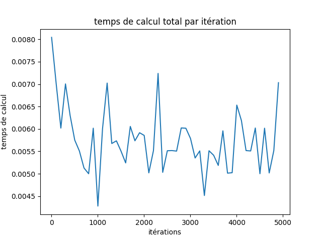
</div>

#### Version paralélisée

<div style="display:flex;">
    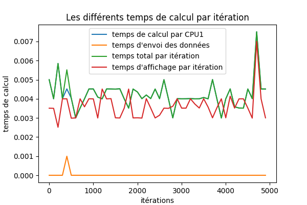
</div>

**Explication de la légende** : 
>- Le *temps de calcul par CPU1* correspond au temps que met CPU1 pour calculer l'itération suivante, à savoir  `ants.advance()` et `pherom.do_evaporation()`
>- Le *temps d'envoi des données* correspond au temps que me CPU1 pour envoyer les données nécessaire à CPU0.
>- Le *temps total par itération* correspond à la somme des deux temps précédent, c'est donc le temps total que prend CPU1.
>- Le *temps d'affichage* correspond au temps que met CPU0 pour afficher le labyrinthe et la fourmis à l'écran.

<div style="text-align: justify;">

Le temps d'envoie des données est très faible, et n'augmente le temps total de manière significative qu'à de rares occasions. En revanche, le temps d'affichage peut dépasser le temps total par itération, autrement dit, il arrive que l'affichage ralentisse la simulation. En effet, tant que l'affichage n'est pas terminé, les Send() de CPU1 vers CPU0 sont bloquant, augmentant donc <i>temps total par itération</i> et diminuant les fps. On ne peut pas utiliser de <code>Isend</code> et de <code>Irecv</code> puisqu'on risquerait de désynchroniser l'affichage du calcul de l'itération.
</div>

#### Comparatif 

|| FPS Moyen  | Nourriture totale récupérée 
 ---: | :---: | :--- 
**Non Parallélisé** | <fps1>176.30496215820312</fps1> | <nourriture1>2327</nourriture1> 
**Affichage et calcul séparés** | <fps2>241.98590087890625</fps2> | <nourriture2>2327</nourriture2>

<div style="text-align: justify;">

Les FPS sont calculés comme l'inverse de <i>temps total par itération</i>, cela prend bien en compte le temps d'affichage puisque si l'affichage prend plus de temps que le calcul de l'itération suivante, les <code>Send</code> de CPU1 vers CPU0 sont bloquant et <i>temps total par itération</i> augmente. Cela ne se voit pas sur le graphique ci-dessus puisque pour des raisons de lisibilité, seul les temps de une itération sur 100 sont affichés. Le schéma ci-dessous explicite cela. On constate un gain significatif de performance, avec un speedup de l'ordre de **1,5**.
</div>

<div style="display:flex;">
    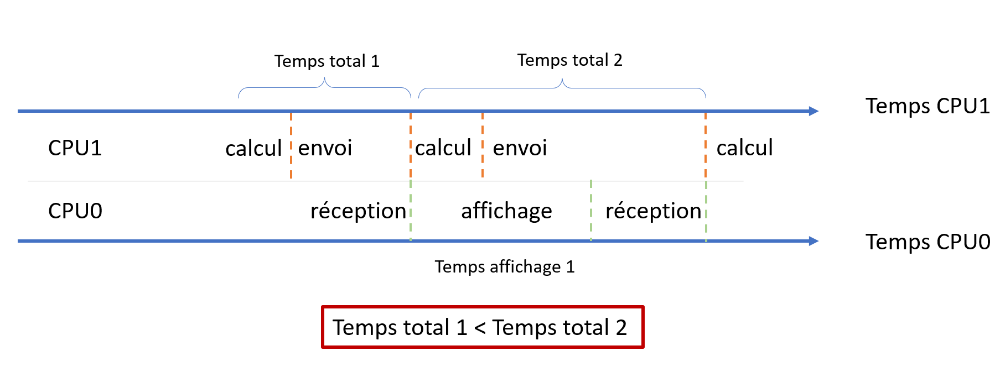
</div>

## Question 2


#### Explication du code

##### Répartition de la colonie dans les différents processus

<div style="text-align: justify;">
Dans cette partie, la colonie de fourmis va être répartie dans plusieurs CPU. CPU0 s'occupe toujours de l'affichage. Cette version du programme sera référencée comme étant la *version 3* du programme. 
Les fourmis sont réparties dans les CPUs de la manière suivante:
</div>

```python
nb_ants = total_ants//(nbp-1)
if total_ants % (nbp-1) != 0 and rank <= total_ants % (nbp-1):
    nb_ants +=1
    ants = Colony(nb_ants, pos_nest, max_life)
else:
    ants = Colony(nb_ants, pos_nest, max_life)
```

<div style="text-align: justify;">
de cette manière, si le nombre de fourmis n'est pas divisible par le nombre de CPUs calculant la prochaine itération (nous noterons <code>m</code> ce nombre dans la suite du rapport), les CPUs dont le rang est inférieur au reste de la division euclidienne par <code>m</code> une fourmi en plus. Cela permet de garder un bon équilibrage des charges. 
</div>

##### Partage des informations au sein de la colonie
La colonie est répartie en <code>m</code> CPUs, mais doit se comporter comme une unique colonie. De ce fait, le tableau de pheromone de chaque sous-colonie doit être partagé: 

```python
newComm.Allreduce(pherom.pheromon,pherom_buff,  MPI.MAX) 
```
<div style="text-align: justify;">

La fonction `Allreduce` permet de construire le buffer <code>pherom_buff</code> qui contient l'intensité maximale de pheromone de chaque case, ce qui correspond bien au comportement souhaité (identique à la version non parallélisé du programme). Ce buffer est ensuite renvoyé aux <code>m</code> CPUs pour que les fourmis de leur sous-colonie puissent choisir leur chemin en capitalisant sur les connaissances des autres sous-colonie.

Néanmoins, l'utilisation des fonctions `Allreduce`, `Gather` et `Gatherv` posent une difficulté. En effet, les données envoyée sont souvent les attributs d'une classe (`pherom.pheromon`, `ants.directions` ...). Cependant, le CPU0 - qui ne s'occupe que de l'affichage -, ne possède pas ces attributs, puisqu'il ne construit aucune instance de la classe `Pheromon`, `Colony`. De ce fait, utiliser simplement `comm.Allreduce(pherom.pheromon, pherom_buff,  MPI.MAX)` conduit à une erreur, CPU0 n'ayant pas d'objet pherom. Pour résoudre ce problème, plusieurs solution sont possible:


>- Eviter les fonctions `Allreduce`, `Gather` et `Gatherv`, pour les remplacer par des `Send` et `Recv`. Mais cela serait assez long à coder et on perdrait beaucoup de temps pour faire tous les envoies (la communication point par point étant plus lente qu'un >`Gather` par exemple). 
>- Créer une instance de la classe visée dans CPU0. Cette solution n'est pas idéal, car l'instance de CPU0 possèderait de nombreux attributs qui lui sont inutile, on perdrait alors l'intéret d'avoir un CPU réservé pour l'affichage. On pourrait néanmoins tirer parti de cette solution en créant une "*surcharge*" de la classe `Pheromon`, ne possédant comme seul attribut le buffer `Pheromon.pheromon`. 
>- Créer des alias pour les attributs ayant le même non que les buffers de CPU0. Mais cela nécessite de créer des buffers temporaires `comm.Allreduce(pherom_buff_old,pherom_buff_new,  MPI.MAX)`, où `pherom_buff_old` est un alias de `pherom.pheromon` et `pherom_buff_new` acceuil les valeurs mises à jour, puisque `Allreduce` requiert que ses deux buffers (de réception et d'envoi) soit différents. Cette solution n'est donc pas viable d'un point de vu mémoire
>- Enfin, nous pouvons créer un sous communicateur: `newComm = comm.Split(rank!=0); newRank = newComm.rank`. De cette manière, CPU0 est isolé tandis que les `m` CPUs sont dans le même sous-communicateur. `Allreduce` est alors appelée dans ce sous-communcateur. Les données devant être communiqué à CPU0 pour l'affichage sont transmisent par l'intermédiaire de CPU1.  

</div>

**Implémentation de cette dernière méthode**

```python
newComm.Gatherv(sendbuf= ants.directions, 
        recvbuf=(directions_buff, nb_ants_per_processus), root=0)
newComm.Gatherv(sendbuf=ants.historic_path.flatten(), 
        recvbuf=(historic_path_buff, nb_historic_path), root=0)
newComm.Gatherv(sendbuf=ants.age, 
        recvbuf=(age_buff, nb_ants_per_processus), root=0)
```

**Remarque :** `root = 0` fait ici reférence à CPU1 qui est numéroté 0 dans le sous-communcateur `newComm`. CPU1 envoie alors ces données à CPU0 qui les réceptionnent:

```python
if rank == 1:
    comm.Send(pherom_buff, dest=0, tag=1)
    comm.Send(directions_buff, dest=0, tag=2)
    comm.Send(historic_path_buff, dest=0, tag=3)
    comm.Send(age_buff, dest=0, tag=4)
```

```python
if rank == 1:
    comm.Recv(pherom_buff, source=1, tag=1)
    comm.Recv(directions_buff, source=1, tag=2)
    comm.Recv(historic_path_buff, source=1, tag=3)
    comm.Recv(age_buff, source=1, tag=4)
```

**Remarque :** Seul CPU0 et CPU1 possède les buffer `pherom_buff`, `directions_buff`, `historic_path_buff` et `age_buff` (ils sont mis à `None` pour les autres processus)

<div style="text-align: justify;">
**Explication des Gatherv :** `Gatherv` permet de récupérer des buffers provenant de différent processus, même si ces derniers n'ont pas tous la même taille (ce qui est le cas si le nombre de fourmis n'est pas divisible par <code>m</code>). Pour cela, il est nécessaire de transmettre un tableau d'offset, indiquant le nombre de donnée (la taille des buffers) attendues de la part de chaque processus. `ants.historic_path` est un np_array de la forme `[nb_ants, max_life+1, 2]`, je ne suis pas parvenu à utiliser Gatherv avec des buffers à trois dimensions, c'est pourquoi il est *applatit* avec la méthode `flatten`. 
</div>

##### Comment assurer que le code parallèle se comporte de la même façon que le code séquentiel ?

<div style="text-align: justify;">
Chaque case du tableau de pheromone dépend des cases adjacentes. Dans la version séquentielle du programme, le tableau de pheromone est mis à jour séquentielement. Autrement dit, si la première case est altérée, la deuxième case sera mise à jour en tenant compte de cette modification. Si ce comportement conduit aux mêmes résultats pour les deux premières versions du programme, il risque de donner des réslutats différents pour la dernière version. En effet, il y a cette fois <code>m</code> tableaux de pheromones, comme la valeur de chaque case dépend des cases environnantes, et que ces cases environnantes n'ont pas la même valeur d'un processus à un autre, on n'obtient pas le même taleau de pheromone que dans les autres versions du programme.   
</div>


<div style="display:flex;">
    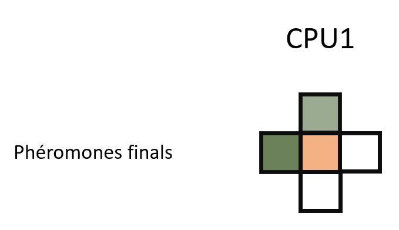
    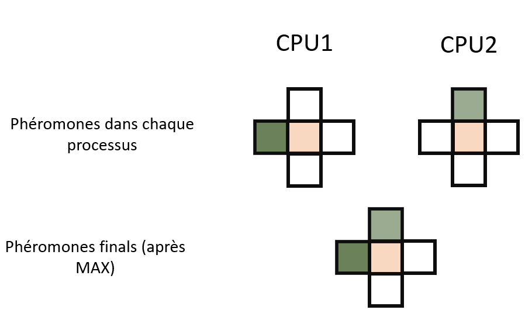
</div>

<div style="text-align: justify;">

Dans ce schéma on se concentre sur la case central, qui dépend donc des cases environnantes. À gauche, (cas non-parallélisé) la case central est plus intense, en effet, elle est influencée par deux cases (à gauche et en haut). À droite (cas parallélisé), comme la colonie est séparée en plusieurs processus, il est possible que la case du haut (CPU1) ne soit pas exploré et donc que la valeur du phéromone soit nulle alors que la case de gauche est non nulle (et inversement pour CPU2). Après le `Allreduce`, on garde le maximum de chaque case, et la case central est moins intense car influencée par une seule case à la fois. 
</div>

Afin de rendre le comportement identique quelque soit la version du programme, la méthode `Pheromon.mark` est mdofiée pour se basé sur un tableau de phéromone fixe :

```python
#Dans Colony.advance
old_pheromones = pheromones.pheromon.copy()

#Dans Pheromon : version modifiée de mark()
def mark(self, old_pheromon, the_position, has_WESN_exits):
    assert(the_position[0] >= 0)
    assert(the_position[1] >= 0)
    cells = np.array([old_pheromon[the_position[0]+1, the_position[1]] if has_WESN_exits[d.DIR_WEST] else 0.,
                        old_pheromon[the_position[0]+1, the_position[1]+2] if has_WESN_exits[d.DIR_EAST] else 0.,
                        old_pheromon[the_position[0]+2, the_position[1]+1] if has_WESN_exits[d.DIR_SOUTH] else 0.,
                        old_pheromon[the_position[0], the_position[1]+1] if has_WESN_exits[d.DIR_NORTH] else 0.], dtype=np.double)
    pheromones = np.maximum(cells, 0.)
    self.pheromon[the_position[0]+1, the_position[1]+1] = self.alpha*np.max(pheromones) + (1-self.alpha)*0.25*pheromones.sum()
```
#### Résultats : comparaison entre la version où l'affichage et le calcul sont sur deux processus distincts avec la version où le calcul est effectué sur plusieurs processus


<div style="display:flex;">
    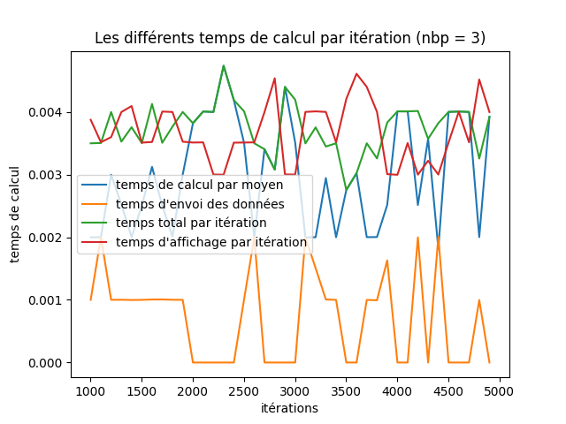
    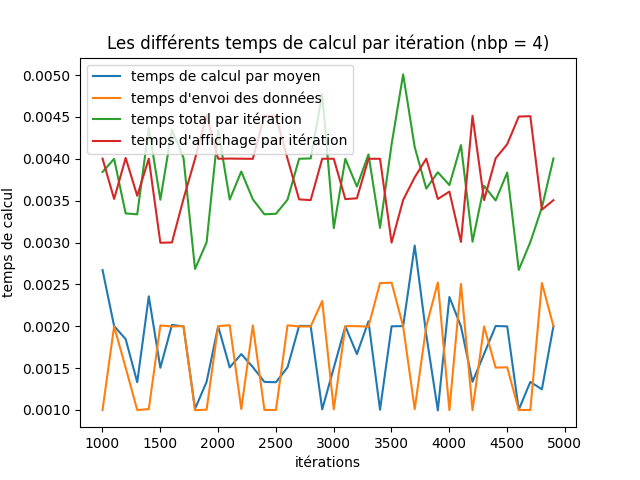
    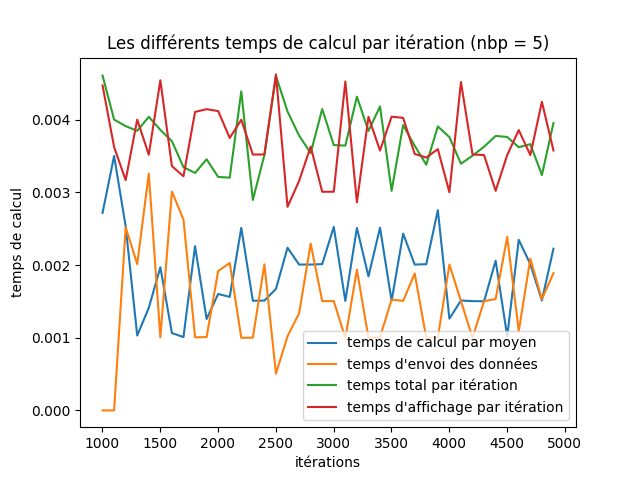
</div>
<div style="display:flex;">
    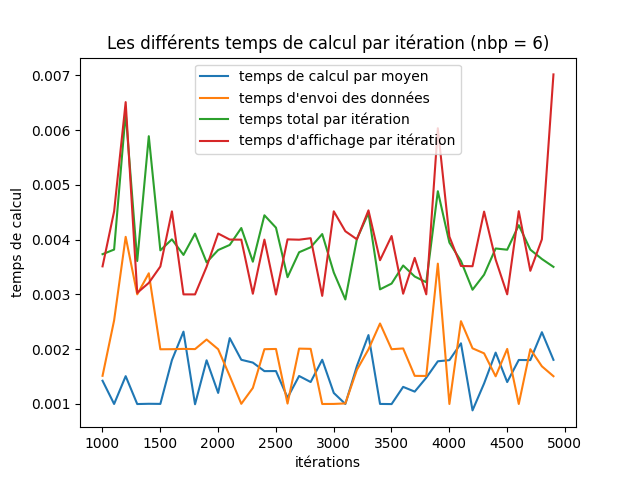
    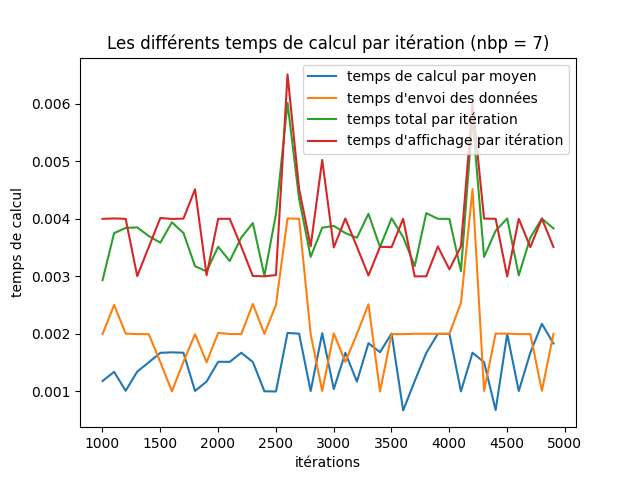
    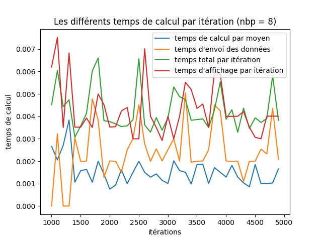
</div>

<div style="text-align: justify;">

**Remarque** : à la différence de la question 1, ici, **temps total par itération** prend également en compte le temps des `Gatherv` sur CPU1, autrement, le temps est moyenné sur les processus, et on ajoute le temps d'envoie des données de CPU1 vers CPU0.

**Remarque:** : les plot commence à 10:

```python
plt.plot(X[selection[10:]], temps_calcul[selection[10:]], label="temps de calcul par moyen")
plt.plot(X[selection[10:]], temps_envoie[selection[10:]], label="temps d'envoi des données")
plt.plot(X[selection[10:]], temps_total[selection[10:]], label="temps total par itération")
plt.plot(X[selection[10:]], temps_affichage[selection[10:]], label="temps d'affichage par itération")
```

en effet, on observe un cold start, sur *temps total par itération*, qui correspond sûrement au temps d'initialiser les communications et de charger des données dans le cache.

On constate qu'à partir de 5 processus, le *temps d'affichage* dépasse le *temps total par itération*. En effet, le temps total diminue par processus, puisque chaque processus gère moins de fourmis à la fois. En revanche, le temps d'affichage lui reste constant (cf. tableau ci-dessous). L'affichage devient donc limitant à partir de 4 processus (1 pour l'affichage et 3 pour le calcul). On remarque égelement que pour 7 et 8 processus, le *temps total par itération* semble plus suivre la courbe du *temps d'affichage*, ce qui est normal, comme expliqué sur schéma en fin de question 2, le temps d'affichage impact le *temps total par itération* de l'itération suivante. Ainsi, si la courbe du *temps total* suit plus celle du *temps d'affichage* pour un plus grand nombre de CPU, c'est parceque le temps d'affichage est systématiquement plus long que le temps total. En d'autre terme, le *temps total* est majoritairement influencé par le *temps d'affichage*.     

</div>

|| FPS Moyen | Temps de calcul moyen | Temps d'envoi des données moyen | Temps total moyen | Temps d'affichage | Nourriture totale récupérée 
 ---: | :---: | :---: |:---: |:---: |:---: |:--- 
**Affichage et calcul séparés** | <fps2>241.98590087890625</fps2> | <tempscalcul2>0.003163543762639165</tempscalcul2> | <tempsenvoie2>0.00015250258445739746</tempsenvoie2> | <tempstotal2>0.003260256489738822</tempstotal2> | <affichage2>0.0035371261183172464</affichage2> |<nourriture2>2327</nourriture2>
**Calcul sur 3 processus** | <fps3>269.0768916134045</fps3> | <tempscalcul3>0.003163543762639165</tempscalcul3> | <tempsenvoie3>0.0007919840335845948</tempsenvoie3> | <tempstotal3>0.003260256489738822</tempstotal3> | <affichage3>0.003686083936691284</affichage3> | <nourriture3>2156</nourriture3>
**Calcul sur 4 processus** | <fps4>274.76682939754437</fps4> | <tempscalcul4>0.004164544762649165</tempscalcul4> | <tempsenvoie4>0.0013937244415283202</tempsenvoie4> | <tempstotal4>0.004260256489748822</tempstotal4> | <affichage4>0.003752710962295532</affichage4> | <nourriture4>2349</nourriture4>
**Calcul sur 5 processus** | <fps5>276.1996430468367</fps5> | <tempscalcul5>0.005165555762659165</tempscalcul5> | <tempsenvoie5>0.0015756237506866456</tempsenvoie5> | <tempstotal5>0.005260256589758822</tempstotal5> | <affichage5>0.003776079273223877</affichage5> | <nourriture5>1996</nourriture5>
**Calcul sur 6 processus** | <fps6>266.06077214288405</fps6> | <tempscalcul6>0.006166566762669165</tempscalcul6> | <tempsenvoie6>0.001826386547088623</tempsenvoie6> | <tempstotal6>0.006260256689768822</tempstotal6> | <affichage6>0.0038754003524780274</affichage6> | <nourriture6>2178</nourriture6>
**Calcul sur 7 processus** | <fps7>263.91825458751845</fps7> | <tempscalcul7>0.007167577762679165</tempscalcul7> | <tempsenvoie7>0.002179884910583496</tempsenvoie7> | <tempstotal7>0.007260256789778822</tempstotal7> | <affichage7>0.0038964797019958495</affichage7> | <nourriture7>2202</nourriture7>
**Calcul sur 8 processus** | <fps8>242.1956177355635</fps8> | <tempscalcul8>0.008168588762689165</tempscalcul8> | <tempsenvoie8>0.002083338165283203</tempsenvoie8> | <tempstotal8>0.008260256889788822</tempstotal8> | <affichage8>0.0041294069290161136</affichage8> | <nourriture8>1939</nourriture8>

<div style="text-align: justify;">

**Remarque :** Le temps de calcul moyen (`ants.advance` et `pherom.do_evaporation`) augmente, alors qu'il y a de moins en oins de fourmis par processus, je ne vois pas de raison particulière à cela. 

**Remarque :** On remarque que malgré notre tentative d'assurer le même comportement pour toutes les versions du programme, la nourriture finale varie suivant le nombre de CPU. Cela se confirme d'ailleurs en regardant de plus près la simulation qui se comporte différement ou encore en regardant l'évolution de la quantité de nourriture au cours des itérations :
</div>


<div style="display:flex;">
    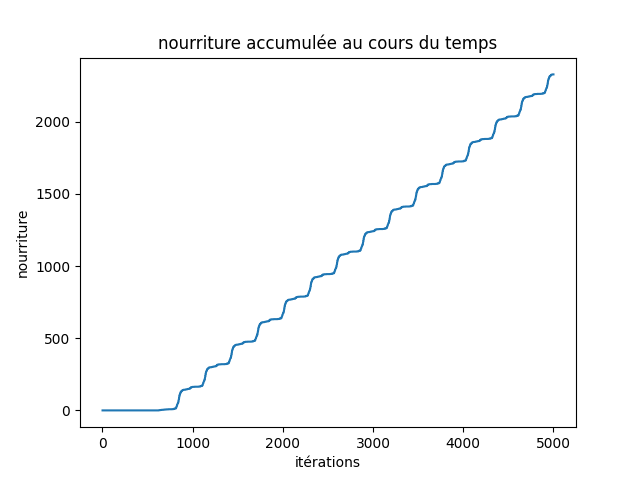
    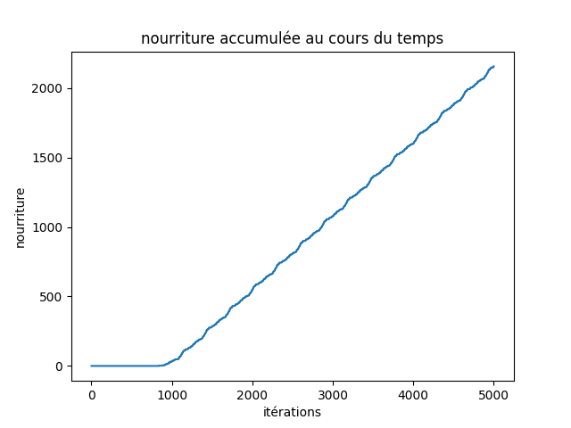
</div>

<div style="text-align: justify;">

À gauche l'évolution de la nourriture pour la version non parallélisée et à droite l'évolution de la nourriture pour la version avec plusieurs processus sur le calcul. Après de longue recherche pour déboguer l'origine de cette divergence. On constate que cette dernière provient de l'attribut `seed` de la classe `Colony` est responsable de cette divergence: 
</div>

```python
self.seeds = np.arange(1, nb_ants+1, dtype=np.int64)
self.seeds[:] = np.mod(16807*self.seeds[:], 2147483647)
```
<div style="text-align: justify;">

Dans un premier temps, la seed est calculée en fonction du nombre de fourmis dans la colonie (où la sous-colonie). Comme dans la version 3 du programme, chaque CPU possède une sous-colonie (avec un moins grand nombre de fourmis), la seed diverge donc à partir des fourmis de la sous-colonie du processus numéroté 2, puisque  `np.arrange()` recommence de 0. Il est possible de réctifier cela en transmettant en argument les indices à utiliser pour le `np.arrange` de sorte à ce que si l'on concatène toutes les seeds, on retrouve le tableau de seed de la version 1 du programme. Néanmoins, une autre ligne pose problème:
</div>

```python
while np.any(valid_moves[ind_exploring_ants] == 0):
    # Calculating indices of ants whose last move was not valid:
    ind_ants_to_move = ind_exploring_ants[valid_moves[ind_exploring_ants] == 0]
    self.seeds[:] = np.mod(16807*self.seeds[:], 2147483647)
```

<div style="text-align: justify;">

`valid_moves` fait la taille de la colonie, l'opération `self.seeds[:] = np.mod(16807*self.seeds[:], 2147483647)` est donc effectuée plus de fois dans la version 1 du programme que dans la version 3. Ainsi, `seeds` diffère d'une version à l'autre. Pour s'assurer d'avoir exactement le même comportement entre toutes les versions, il faudrait changer ces lignes. Toutefois, pour évaluer les performances de la parallélisation, il n'est pas forcément nécessaire de le faire, puisque quelque soit la version, autant d'opération seront effectuées.
</div>

**Speedup**
On peut alors tracer l'évolution du speedup en fonction du nombre de processus:

<div style="display:flex;">
    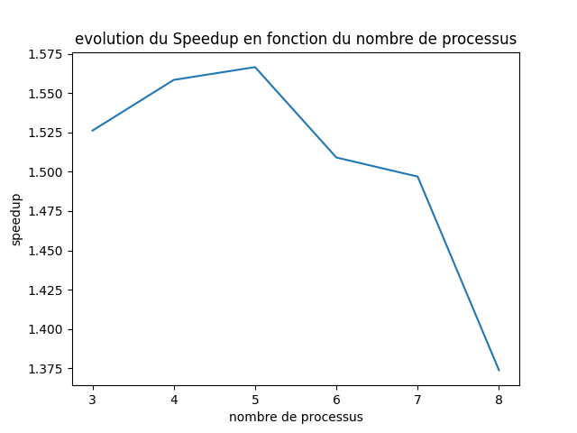
    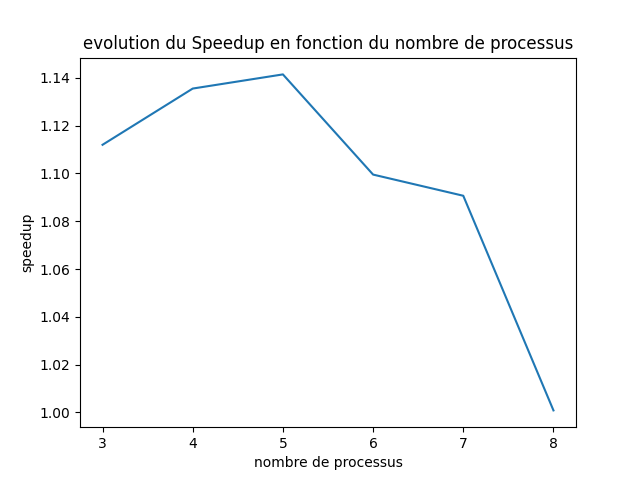
</div>

<div style="text-align: justify;">
À gauche, l'évolution du speedup par rapport à la version non parallélisé, à droite, l'évolution du speedup par rapport à la deuxième version du programme (affichage séparé).

Le speedup est donc maximal pour 5 processus, soit 4 travaillant sur le calcul de l'itération suivante et 1 sur l'affichage. En regardant de plus près les 6 courbes comparant le temps d'envoie des données, le temps de calcul moyen par processeur et le temps totale, on se rend compte que le temps d'envoie des données est près de deux fois plus long entre une exécution sur 8 processus et une exécution sur 3 processus. Si le temps d'envoie augmente, c'est parceque les opérations `Gatherv, Gather, Allreduce et Reduce` prennent d'autant plus de temps qu'il y a de processus.

Avec ce constat, on peut être tenter de réduire le temps d'envoie en enyoant un seul grand buffer: 
</div>

```python 
global_buffer = np.empty(total_ants+total_ants*(max_life+1)*2+total_ants+1, dtype=np.int16)
```

Tous les attributs nécessaire ont été converties en np.int16. Les Send du processus 1 vers 0 se résume alors à:

```python
comm.Send(pherom_buff, dest=0, tag=2)
comm.Send(global_buffer, dest=0, tag=3)
```

pherom_buff doit être envoyé à part car il est de type flottant. Les Gatherv se résument à:

```python
newComm.Gatherv(sendbuf= ants.directions, 
        recvbuf=(global_buffer, nb_ants_per_processus), root=0)
newComm.Gatherv(sendbuf=ants.historic_path.flatten(), 
        recvbuf=(global_buffer[total_ants:], nb_historic_path), root=0)
newComm.Gatherv(sendbuf=ants.age, 
        recvbuf=(global_buffer[total_ants+total_ants*(max_life+1)*2:], nb_ants_per_processus), root=0)
```


<div style="display:flex;">
    
    
    
</div>
<div style="display:flex;">
    
    
    
</div>


|| FPS Moyen | Temps de calcul moyen | Temps d'envoi des données moyen | Temps total moyen | Temps d'affichage 
 ---: | :---: | :---: |:---: |:---: |:--- 
**Calcul sur 3 processus** | <fps23>257.4942161002926</fps23> | <tempscalcul23>0.003163543762639165</tempscalcul23> | <tempsenvoie23>0.0007704368114471435</tempsenvoie23> | <tempstotal23>0.003260256489738822</tempstotal23> | <affichage23>0.0036340225219726563</affichage23>
**Calcul sur 4 processus** | <fps24>279.7237568653652</fps24> | <tempscalcul24>0.004164544762649165</tempscalcul24> | <tempsenvoie24>0.001256750726699829</tempsenvoie24> | <tempstotal24>0.004260256489748822</tempstotal24> | <affichage24>0.003686715507507324</affichage24>
**Calcul sur 5 processus** | <fps25>273.7715487034112</fps25> | <tempscalcul25>0.005165555762659165</tempscalcul25> | <tempsenvoie25>0.0015405003547668457</tempsenvoie25> | <tempstotal25>0.005260256589758822</tempstotal25> | <affichage25>0.0037839099407196044</affichage25>
**Calcul sur 6 processus** | <fps26>260.8980058000399</fps26> | <tempscalcul26>0.006166566762669165</tempscalcul26> | <tempsenvoie26>0.001833205270767212</tempsenvoie26> | <tempstotal26>0.006260256689768822</tempstotal26> | <affichage26>0.0037976096630096437</affichage26>
**Calcul sur 7 processus** | <fps27>252.91300952064626</fps27> | <tempscalcul27>0.007167577762679165</tempscalcul27> | <tempsenvoie27>0.0020523264408111573</tempsenvoie27> | <tempstotal27>0.007260256789778822</tempstotal27> | <affichage27>0.003894227743148804</affichage27>
**Calcul sur 8 processus** | <fps28>265.03167969209625</fps28> | <tempscalcul28>0.008168588762689165</tempscalcul28> | <tempsenvoie28>0.0020896265983581545</tempsenvoie28> | <tempstotal28>0.008260256889788822</tempstotal28> | <affichage28>0.0040276616573333745</affichage28>

<div style="text-align: justify;">

On ne constate aucun gain sur le temps d'envoie des données, qui adopte un profile très similaire à la version précédente. On peut penser que `global_buffer` est trop grand et qu'il est de toutes manières envoyés en plusieurs fois. Aussi les `Gathervn Gather, Allreduce et Reduce` prennent toujours autant de temps et sont toujours aussi nombreux, c'est sûrment le temps prit par ces opérations qui prédomine les temps d'envoies.  

</div>

**Speedup**
On peut alors tracer l'évolution du speedup en fonction du nombre de processus:

<div style="display:flex;">
    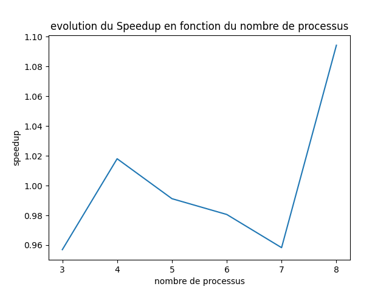
</div>

<div style="text-align: justify;">
Sans surprise, Le speedup par rapport à la version 3 n'est pas significatif. On peut peut-être éspérer une différence plus marquante si un plus grand nombre de fourmis est utilisée. En effet, cela permettrait de jouer sur la granularité du problème, et d'obtenir un meilleur ratio *calcul/données envoyées*.
</div>

## Question 3

Dans cette question, on cherche quelques piste de reflexion pour parallaléliser à la fois la colonie et le labyrinthe. On s'attaque alors à un problème à la fois eulérien et lagrangien. 

### Première idée

<div style="text-align: justify;">

Le temps d'affichage est limitant dans la parallélisation du problème, il faudrait donc réussir à séparer l'affichage en plusieurs processus. Il faudrait donc se renseigner sur la possiblité de séparer l'affichage avec pygame. Les processus calculant l'itération suivante auraient accès au labyrinthe en entier et enverraient à chaque processus gérant l'affichage la portion du labyrinthe qui le concerne. Il n'y aurait donc pas de ghost cells à gérer.
</div>

### Deuxième idée

<div style="text-align: justify;">

On peut séparer le problème en plusieurs sous labyrinthe, chacun de ces sous-labyrinthe serait afficher par 1 processus, et les fourmis de ce sous-labyrinthe seraient diriger par d'autres processus. Par exemple, si le labyrinthe est scindé en 4, il y aura `m/4` CPU pour calculer la prochaine itération au sein de ce sous labyrinthe.

Mais cette approche entraine des difficultées. Déjà, il faudra prendre en compte les ghost cells, puisque le calcul des phéromones dépend des valeurs environnantes et que les fourmis peuvent passer d'un sous-labyrinthe à un autre. Un autre problème est le load balancing, au vu des simulations, les fourmis on tendance à explorer une partie du labyrinthe seulement, laissant ainsi de potentiel processus s'occupant des région inexploré du labyrinthe sans travail. Une approche maître escalve pourrait donc être envisagée. Accompagnée d'une heurisitique, le processus maître pourrait alors rediriger les processus sans travail vers des régions plus exploré du labytinthe. Cette heurisitique pourrait prendre en compte le fait qu'une fois la nourriture trouvé, les régions inexplorées le resterons.
</div>

</span>
</span>